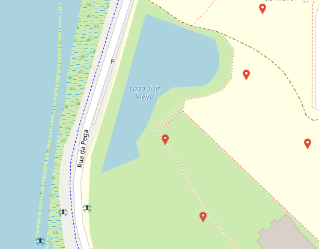

# Drones-Scanning
This project was developed within the scope of the curricular unit Networks and Autonomous Systems.

## Resume
The objective of this project is to use drones to analyze agricultural fields, using the V2C communication type in the context of VANET networks (Vehicular Ad Hoc Networks).

## Getting Started

Follow the steps below to set up and run the project:

1. Push the image from [https://code.nap.av.it.pt/mobility-networks/vanetza](https://code.nap.av.it.pt/mobility-networks/vanetza).

2. Open three terminals.

3. In the first terminal, run the following command: sudo docker-compose up -d

4. In the second terminal, run the following command: python3 app.py

5. In the third terminal, run the following command: python3 obu_simulation.py

## Project Map Example when run the project

